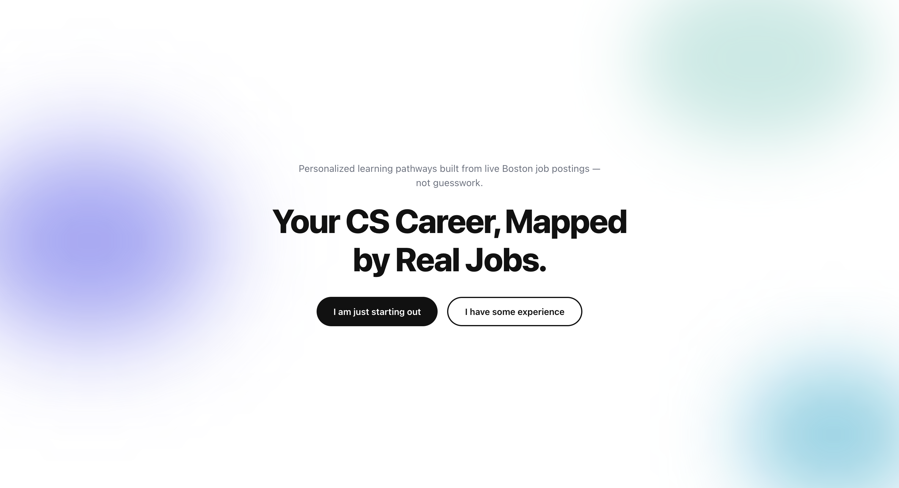
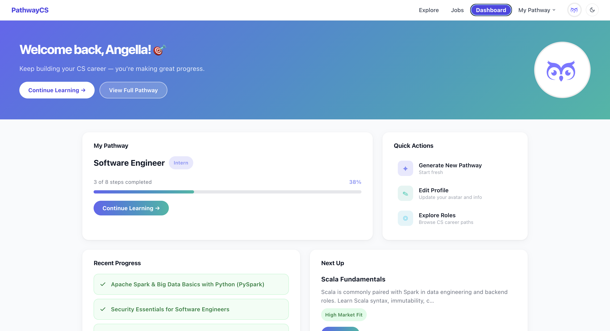
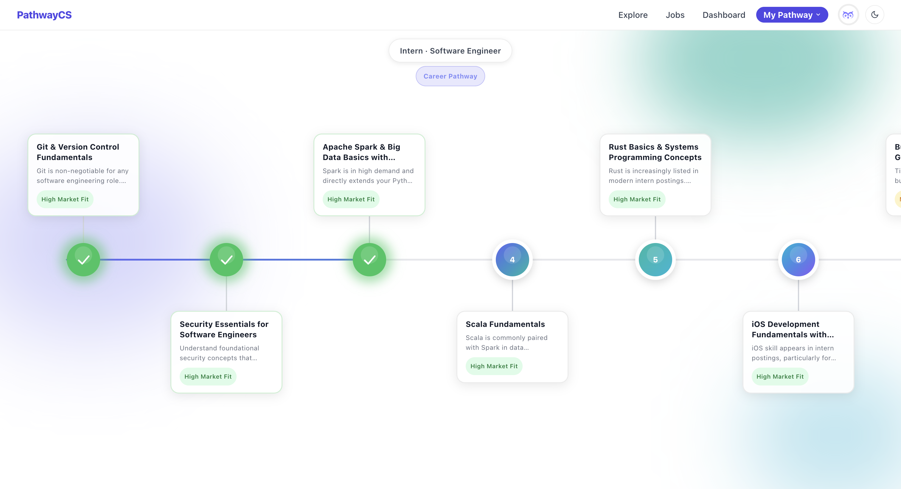
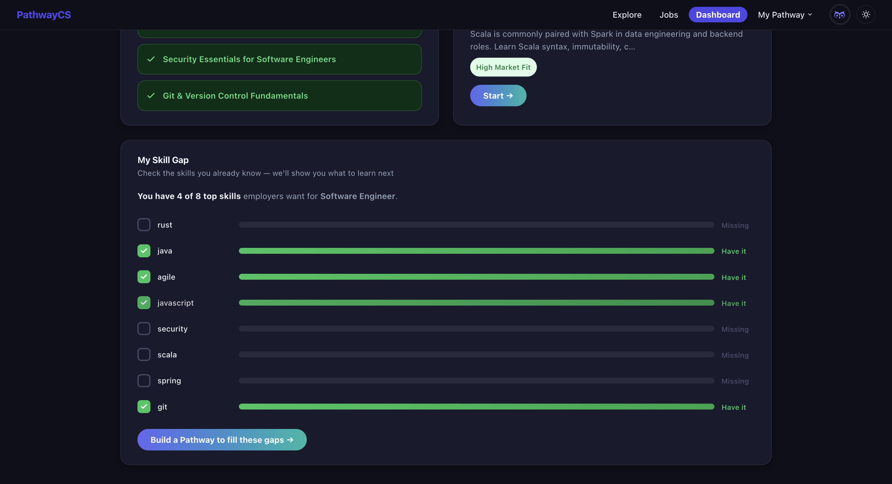
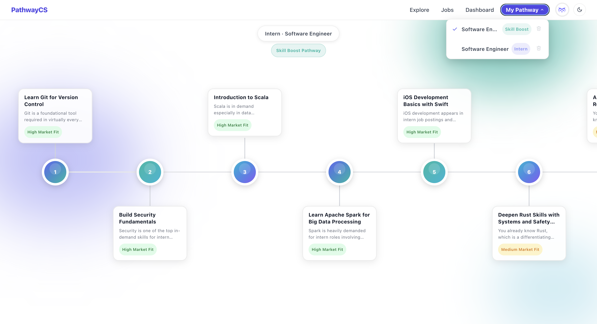
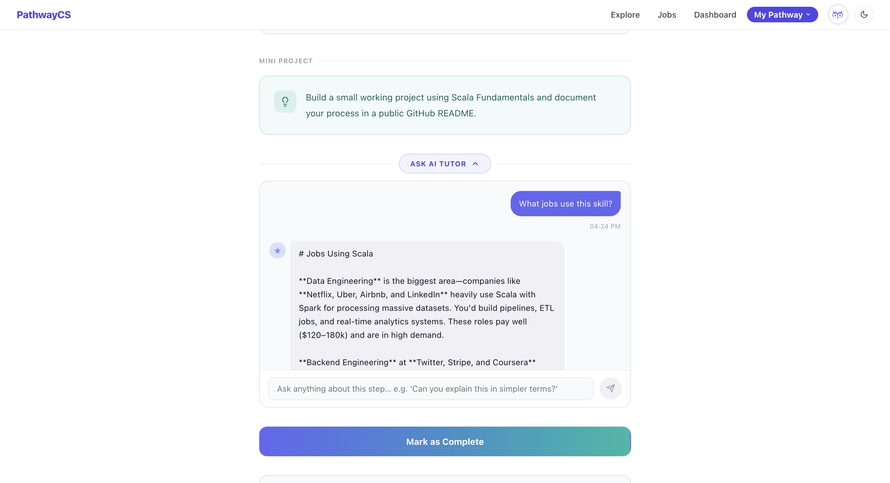
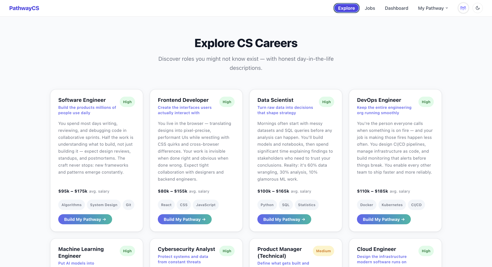

# PathwayCS

> **Personalized CS learning roadmaps built from live Boston job postings — not guesswork.**

[](https://pathwaycs.vercel.app)

---

## About

PathwayCS generates personalized computer science learning roadmaps by analyzing **real, current job postings** from the Boston tech market — not static curricula written years ago.

Most learning platforms tell you to study the same generic list of topics regardless of what employers actually want. PathwayCS is different: it scrapes live job listings, identifies the skills that show up most frequently for your target role and level, and builds a step-by-step pathway around exactly those skills. If the market shifts, so does your roadmap.

Whether you're a complete beginner exploring CS or an experienced developer targeting a specific role, PathwayCS meets you where you are and shows you the fastest path from your current skills to your next job.

---

## Features

- **Live market-driven roadmaps** — pathways are built from real Boston job postings, not guesswork
- **Personalized onboarding** — beginner and experienced tracks that tailor the roadmap to your current skills and target role
- **Skill Gap Visualizer** — see exactly which in-demand skills you're missing and generate a focused pathway to close the gap
- **Multi-pathway management** — save, switch between, and delete multiple learning pathways from the navbar
- **Step-by-step roadmap view** — interactive timeline with per-step resources, mini projects, and market relevance scores
- **AI Tutor chat** — collapsible in-step AI assistant to explain concepts, suggest projects, and answer questions
- **Progress tracking** — mark steps complete; progress is saved and reflected across the dashboard
- **Job board** — browse live Boston CS job listings filtered by role and level
- **Role explorer** — discover and explore CS career paths with market demand data
- **Dark mode** — full light/dark theme toggle, preference persisted across sessions
- **Avatar picker** — personalized avatar that persists across login/logout
- **Guest-friendly** — generate and view a pathway without an account; sign up later to save progress

---

## Tech Stack

| Layer | Technology |
|---|---|
| **Frontend** | React 18, Vite, React Router v6 |
| **Backend** | FastAPI (Python), deployed on Render |
| **Database** | Supabase (PostgreSQL) |
| **Auth** | Supabase Auth |
| **AI** | Anthropic Claude API |
| **Job Data** | Live scraping from Boston job postings |
| **Deployment** | Vercel (frontend) · Render (backend) |

---

## Screenshots















---

## Getting Started

### Prerequisites

- Node.js 18+
- Python 3.10+
- A [Supabase](https://supabase.com) project
- An [Anthropic](https://console.anthropic.com) API key

### 1. Clone the repo

```bash
git clone https://github.com/angellaa24/pathwaycs.git
cd pathwaycs
```

### 2. Set up the backend

```bash
# Create and activate a virtual environment
python3 -m venv venv
source venv/bin/activate  # Windows: venv\Scripts\activate

# Install dependencies
pip install -r requirements.txt

# Create a .env file in the project root (see Environment Variables below)
```

### 3. Run the backend

```bash
uvicorn main:app --reload
# Runs at http://localhost:8000
```

### 4. Set up and run the frontend

```bash
cd frontend
npm install

# Create a .env.local file in the frontend folder (see Environment Variables below)
npm run dev
# Runs at http://localhost:5173
```

---

## Environment Variables

### Backend — `.env` (project root)

```env
SUPABASE_URL=your_supabase_project_url
SUPABASE_KEY=your_supabase_service_role_key
ANTHROPIC_API_KEY=your_anthropic_api_key
```

### Frontend — `frontend/.env.local`

```env
VITE_SUPABASE_URL=your_supabase_project_url
VITE_SUPABASE_ANON_KEY=your_supabase_anon_key
VITE_API_URL=http://localhost:8000
```

> In production, set `VITE_API_URL` to your deployed backend URL (e.g. `https://your-app.onrender.com`). If the variable is not set, the frontend falls back to the hardcoded Render URL automatically.

---

## Author

**Angella Perez**
[github.com/angellaa24](https://github.com/angellaa24)
